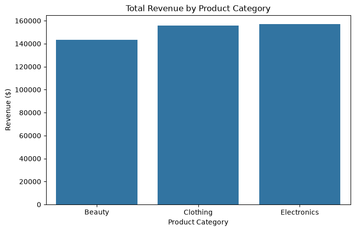
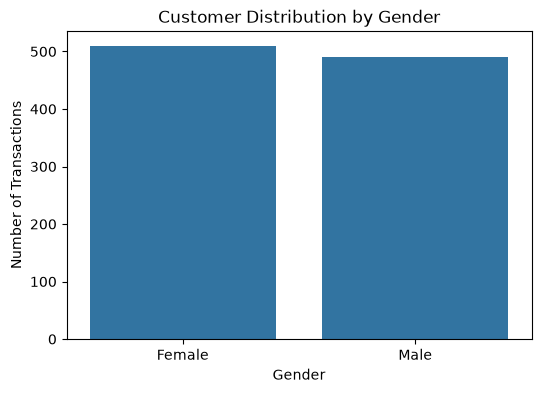
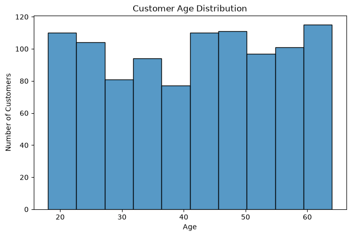
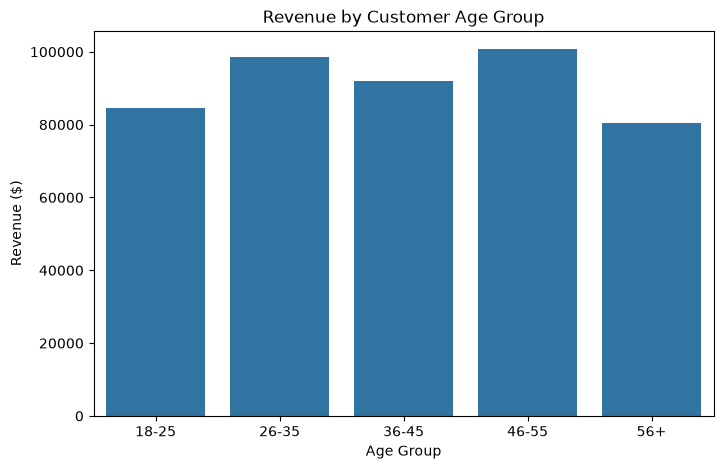
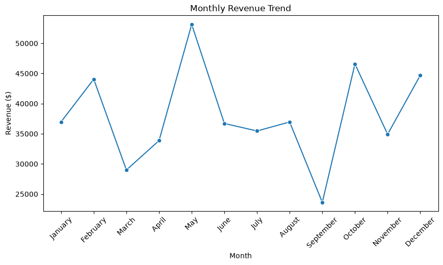

# Retail Store Sales & Customer Analysis

## Project Overview

This project analyses retail transaction data to understand sales performance, customer behaviour, and product category trends.

The goal of this analysis is to identify revenue drivers, customer segments, and sales patterns that can support business decision-making.

---

## Business Problem

A retail store wants to better understand:

- Overall sales performance
- Which product categories generate the most revenue
- Customer purchasing behaviour
- Sales trends over time
- Which customer groups contribute the most value

This project uses exploratory data analysis and visualisation techniques to answer these business questions.

---

## Dataset

The dataset contains 1,000 retail transactions with the following information:

- Transaction ID
- Date
- Customer ID
- Gender
- Age
- Product Category
- Quantity
- Price per Unit
- Total Amount

---

## Tools & Technologies

- Python
- Pandas
- NumPy
- Matplotlib
- Seaborn
- Jupyter Notebook
- Git & GitHub

---

## Key Analysis & Findings

### Sales Performance

- Total revenue generated: **$456,000**
- Total transactions analysed: **1,000**
- Average transaction value: **$456**

---

### Product Category Analysis

Electronics generated the highest revenue:

- Electronics: **$156,905**
- Clothing: **$155,580**
- Beauty: **$143,515**

Clothing had the highest number of units sold:

- Clothing: **894 units**
- Electronics: **849 units**
- Beauty: **771 units**

---

### Customer Analysis

The customer base was evenly distributed:

- Female customers: **510**
- Male customers: **490**

Customers aged 46-55 generated the highest revenue contribution:

- 46-55 age group: **$100,690**

---

### Monthly Sales Trends

The strongest sales month was:

- May: **$53,150**

The lowest sales month was:

- September: **$23,620**

Monthly performance varied throughout the year, suggesting opportunities for targeted campaigns during slower periods.

---

## Visualisations

### Revenue by Product Category



### Customer Gender Distribution



### Customer Age Distribution



### Revenue by Age Group



### Monthly Revenue Trend



---

## Business Recommendations

Based on the analysis:

1. Continue supporting Electronics and Clothing categories due to their strong revenue contribution.

2. Explore strategies to increase Beauty category sales through promotions and targeted marketing.

3. Develop marketing campaigns for valuable customer segments, especially the 46-55 age group.

4. Investigate successful factors behind high-performing months and apply similar strategies during slower periods.

---

## Project Structure

```
Project-1-Retail-Sales-Analysis/

├── data/
│   └── retail_sales_dataset.csv
│
├── images/
│   ├── revenue_by_category.png
│   ├── customer_gender_distribution.png
│   ├── customer_age_distribution.png
│   ├── revenue_by_age_group.png
│   ├── monthly_revenue_trend.png
│   ├── quantity_by_category.png
│   └── average_price_by_category.png
│
├── notebooks/
│   └── 01_Retail_Sales_Analysis.ipynb
│
├── src/
│
├── requirements.txt
│
└── README.md
```

---

## Author

Masooma Jafari

Data Science Graduate